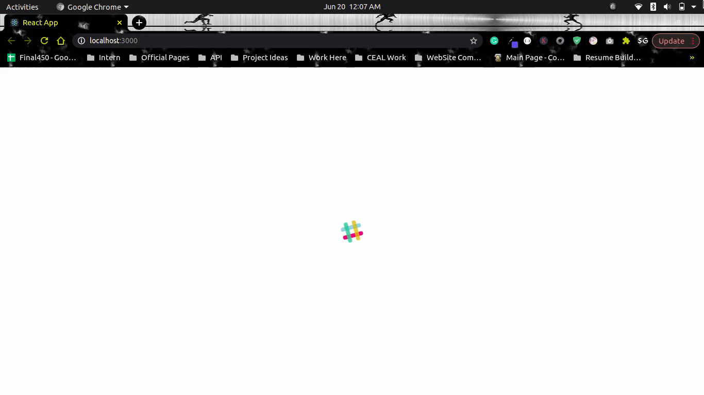

# react-animated-loader



### Features
- Light weight package
- Easy to use
- Colourful and animated

### Installation
Using npm:
```
npm install react-animated-loader
```

### Example 
```
import React from 'react'
import Loader from 'react-animated-loader'; // import the package

const AnimatedLoader = () => {
	return (
		<div>
			<Loader />
		</div>
	)
}

export  default AnimatedLoader
```

## License
[MIT](LICENSE)